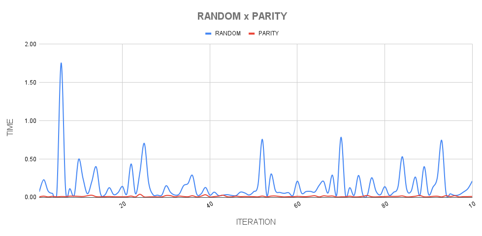
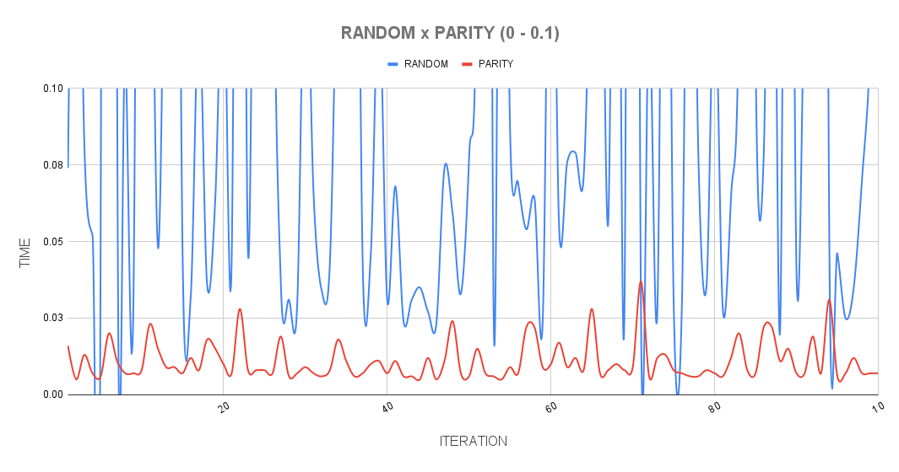
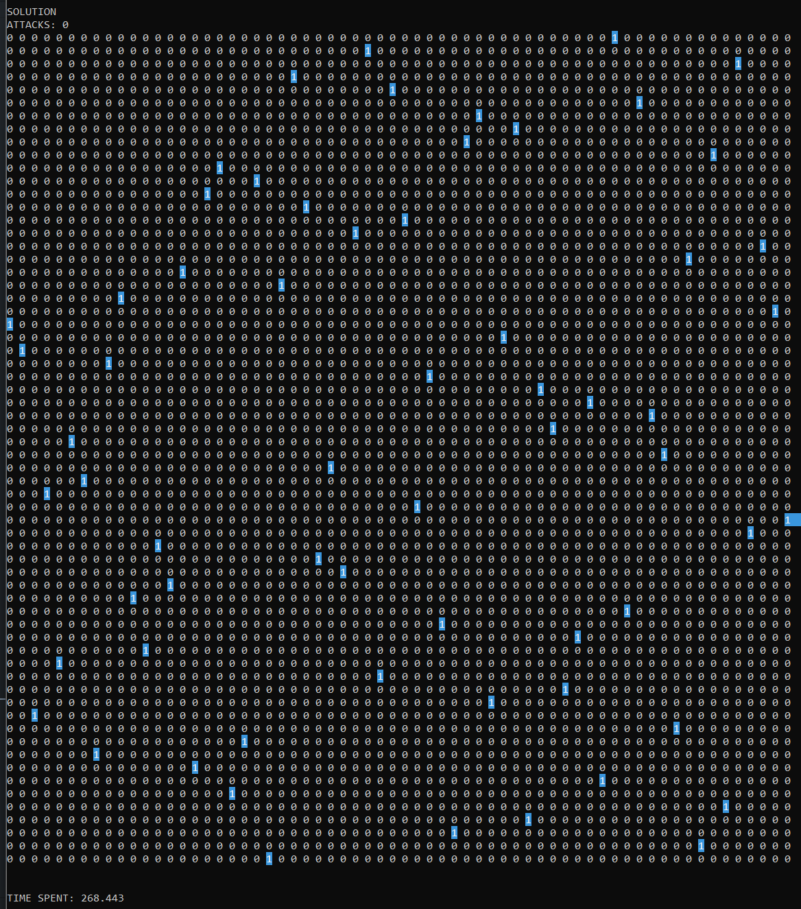
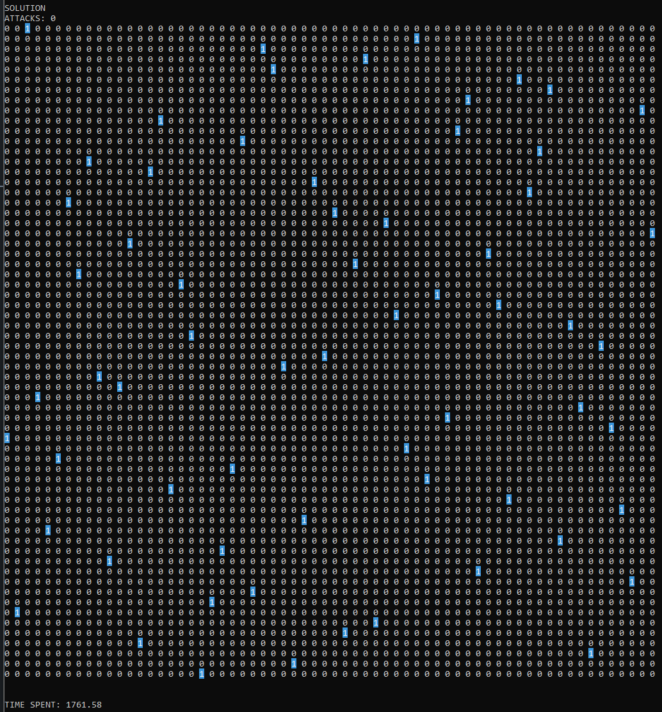

# NQueens
This repository contains a comparison between different algorithms used to solve the NQueens problem.
  

## Methods
TODO
  

## Performance
In this section, the graphical comparison of performance between the two methods mentioned in the previous topic is presented.
  

Performance comparison between Random and Parity methods

 

Performance comparison between Random and Parity methods (zoom applied)

  

## 64x64 Board 
The Parity method was able to converge a 64x64 board to the solution in approximately 4min28s, while the Random method needed approximately 29min21s.

 

64x64 board solved with Parity Method

 

64x64 board solved with Random Method

  